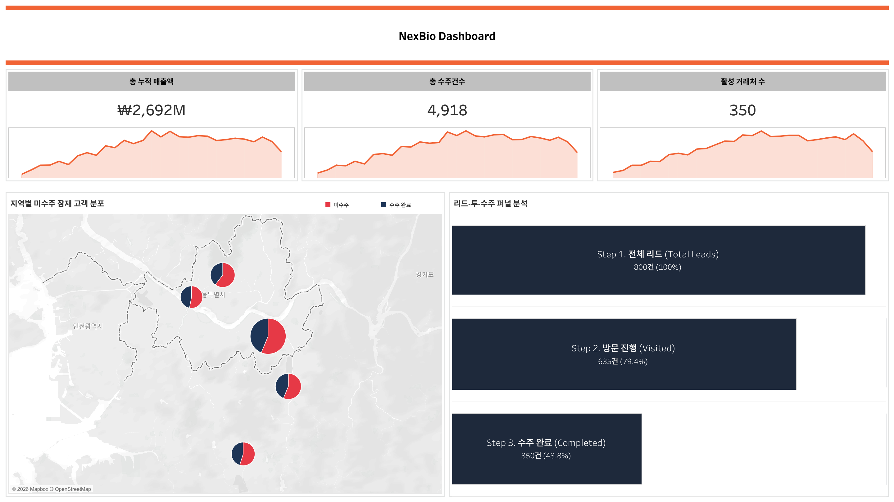
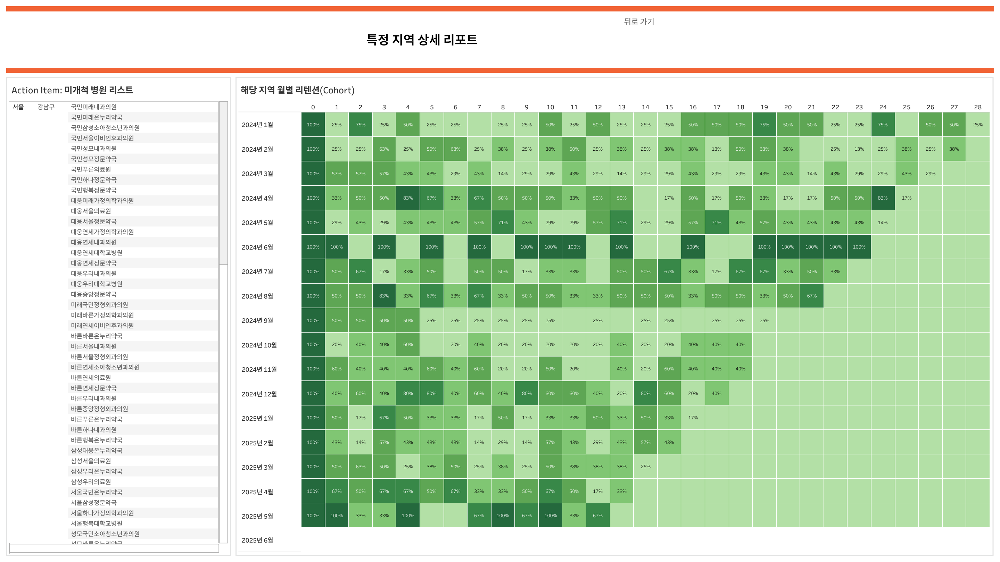

# 📊 B2B CRM 세일즈 파이프라인 및 고객 리텐션 최적화 대시보드

> 분산된 영업 및 고객 데이터를 통합·정제하여 현업의 의사결정에 직접적으로 기여하는 CRM 데이터 분석 프로젝트입니다. 데이터 기반의 우선순위 영업 타겟팅(Action Plan)을 현업 실무자에게 직관적으로 제공하는 데 초점을 맞췄습니다.


## 🎯 Project Overview

이 대시보드는 제약 B2B 영업 조직의 주요 과제인 '신규 리드 전환 효율 극대화'와 '고객 리텐션 패턴 발굴'을 해결하기 위해 기획되었습니다. 비전문가(임원진 및 영업 사원)가 데이터에 기반한 의사결정을 즉각적으로 내릴 수 있도록 2개의 유기적인 대시보드로 구성했습니다.

| Dashboard | 해결하고자 하는 비즈니스 질문 |
|---|---|
| **1. 1. 지역별 타겟 및 파이프라인 효율** | 파이프라인의 병목 구간은 어디이며, 최우선으로 공략할 전략적 타겟 지역(White Space)은 어디인가? |
| **2. 영업 타겟 명단 및 리텐션 코호트** | 우호적 거래처의 발주 패턴은 어떠하며, 영업 사원이 당장 내일 방문해야 할 거래처는 어디인가? |

---

## 🛠 Tech Stack

- **Python 3.10+** — Synthetic data generation (NumPy, Pandas)
- **Tableau Desktop 2024.1** — LOD 표현식, 계산된 필드

---

## 📊 Dashboard 1: 지역별 타겟 및 파이프라인 효율 (Overview)

**대상**: C레벨 임원 및 영업 임원 | **목적**: 세일즈 파이프라인 고도화 및 전략 수



### 💡 주요 분석 인사이트
- 세일즈 파이프라인 병목 진단: 초기 리드(800곳)에서 최종 수주까지의 전체 전환율은 **43.8%** 이며, 가장 큰 이탈은 **방문 진행 ➡️ 수주 완료** 구간
- 데이터 기반 지역 타겟팅: 지도 시각화를 통해 타겟 밀집도가 높은 **수도권(서울/경기)** 지역이 신규 전환의 핵심 공략 지점임을 도출
- 발주 패턴 가설 수립: 누적 거래처(350곳)와 월 최대 거래처(155곳)의 차이를 통해 **간헐적 대량 발주** 패턴 가설을 세우고, 코호트 분석으로 검증

### Components
- 3 KPI cards (총 누적 매출액, 총 수주건수, 활성 거래처 수)
- South Korea Region Heatmap (지역별 미수주 잠재 고객 분포)
- Funnel Analysis chart (3 Steps : 리드 - 방문 - 수주)

---

## 📊 Dashboard 2: 액션 아이템 명단 및 코호트 리텐션

**대상**: 영업 실무자 | **목적**: 거래처 유형 분류 및 즉각적인 영업 액션 지원



### 💡 주요 분석 인사이트
- 운영 패턴(리텐션) 분석: 코호트 히트맵 분석 결과, 대다수의 거래처가 **3~4개월 주기**로 높은 재발주율(가장 짙은 녹색)을 보이는 우호적 패턴
- 실무자 맞춤형 인사이트 전달: 대시보드1의 지도에서 특정 지역을 클릭하면, 해당 지역내 **미수주 거래처 명단이 필터링**되어 영업 사원의 액션 유도
- **Premium Reseller leads with 16.0%** overall conversion, **Carrier lags at 5.7%**
- Scatter plot reveals **conversion outliers** by partner tier — Premium Reseller cluster sits highest at 15-17%
- **Avg LTV by tier** shows surprisingly tight band (₩1.85M ~ ₩1.87M) — suggests opportunity to differentiate Premium customer experience further
- **Actionable Anomaly Detection**: Scatter plot isolates a critical outlier with **Top 1 traffic vs. 0.6% CVR**, alerting potential offline "Showrooming" effects or severe inventory bottlenecks.

### Components
- 미개척 병원 리스트
- 거래처 월별 리텐션

---

## 📁 Repository Structure

```
b2b-crm-analytics/
├── README.md
├── generate_data.py                      # Python data generator
├── data/                                 # 1 CSV file (auto-generated)
├── tableau/
│   └── b2b-crm-analytics.twbx    # Packaged Tableau workbook
└── screenshots/                          # Dashboard screenshots
    ├── 01_overview.png
    └── 02_Action_Cohort.png
```

---

## 🎨 시각화 및 UI/UX 설계 원칙

현업 실무자가 복잡한 데이터 분석 결과에 압도되지 않도록, 직관적이고 실용적인 디자인 철학을 적용했습니다.

- **Color discipline** — 안정적인 지표는 네이비 톤, 액션이 필요한 미수주 타겟(Action Needed)에 주황색을 사용하여 정보의 우선순위를 명확히 했습니다.
- **직관적인 UX (Drill-down)** — [필터 액션]을 활용하여 큰 흐름(지도)에서 세부 액션(명단/코호트)으로 화면이 전환되는 형태의 사용자 경험을 구현했습니다.
- **Typography** — Tableau bold / Tableau Book

---

## 📬 Contact

**[Sunghoon Jun]** — Data Analyst
- 📧 trixar17@gmail.com
- 💼 [LinkedIn](https://www.linkedin.com/in/trixar17)
- 📊 [Tableau Public](https://public.tableau.com/app/profile/sunghoon.jun)
- 🧾 [Notion](https://---)

---

## 📄 License

This project uses **synthetic data only**. Built for portfolio purposes.

